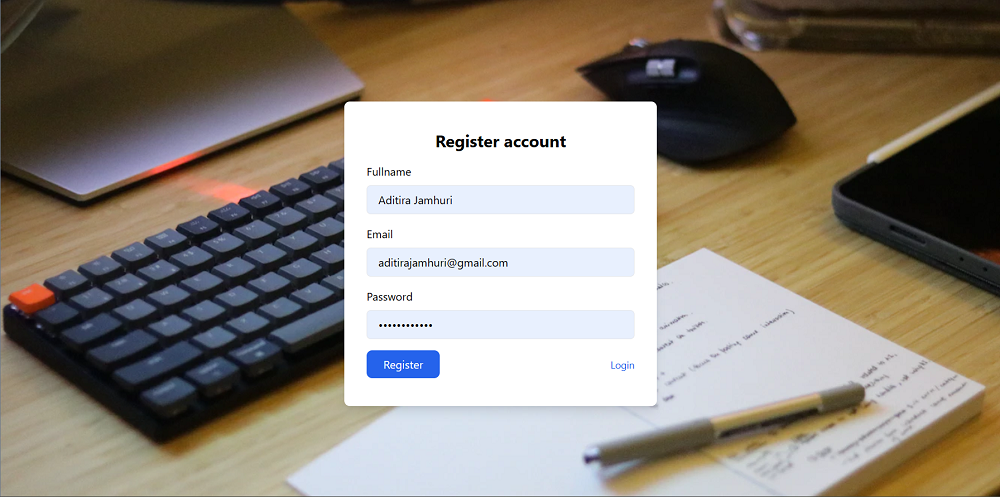
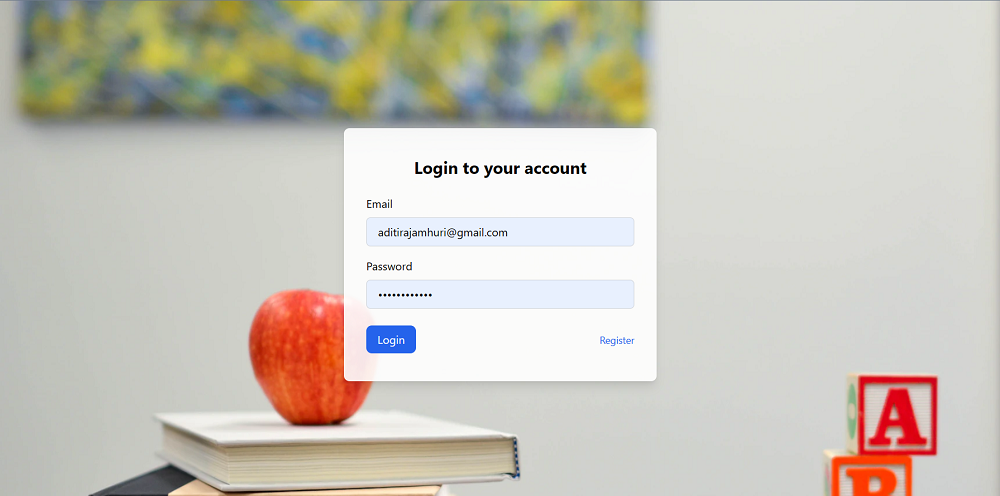

# Web Application

## Final Course Project - Task Tracker Plus


### Description

Ini adalah lanjutan aplikasi dari assignment sebelumnya yaitu **Task Tracker Plus** yang dirancang untuk membantu mahasiswa dalam mengatur jadwal studi mereka. Dibangun menggunakan bahasa pemrograman Go (Golang).

Pada tugas ini, kalian akan mengimplementasikan konsep **REST API** dan juga akan membangun sebuah aplikasi web yang akan mengimplementasikan konsep **MVC**. Aplikasi ini adalah **monolith** dimana seluruh sistemnya memakai server, logika, database, hingga user interface yang sama:

#### Server (Backend)

- **users**
  - Mengirim permintaan **POST** ke endpoint `/user/register` untuk proses registrasi
  - Mengirim permintaan **POST** ke endpoint `/user/login` untuk proses login
  - Mendapatkan daftar user dengan task dan kategorinya dengan mengirimkan permintaan **GET** ke endpoint `/user/tasks`.
- **task**
  - Menambahkan tugas baru dengan mengirimkan permintaan **POST** ke endpoint `/task/add`.
  - Mengambil informasi tugas berdasarkan ID dengan mengirimkan permintaan **GET** ke endpoint `/task/get/:id`.
  - Memperbarui informasi tugas dengan mengirimkan permintaan **PUT** ke endpoint `/task/update/:id`.
  - Menghapus tugas dengan mengirimkan permintaan **DELETE** ke endpoint `/task/delete/:id`.
  - Mendapatkan daftar tugas dengan mengirimkan permintaan **GET** ke endpoint `/task/list`.
  - Mendapatkan daftar tugas berdasarkan ID kategori dengan mengirimkan permintaan **GET** ke endpoint `/task/category/:id`.
- **category**
  - Menambahkan kategori baru dengan mengirimkan permintaan **POST** ke endpoint `/category/add`.
  - Mengambil informasi kategori berdasarkan ID dengan mengirimkan permintaan **GET** ke endpoint `/category/get/:id`.
  - Memperbarui informasi kategori dengan mengirimkan permintaan **PUT** ke endpoint `/category/update/:id`.
  - Menghapus kategori dengan mengirimkan permintaan **DELETE** ke endpoint `/category/delete/:id`.
  - Mendapatkan daftar kategori dengan mengirimkan permintaan **GET** ke endpoint `/category/list`.

Gunakan fungsi pada subpackage di `db/filebased` untuk berhubungan dengan database, seluruh fungsinya dapat dipelajari di `db/filebased/README.md` dan juga kamu bisa membaca sendiri kode yang ada di dalamnya.

> **Note**: untuk mengakses endpoint `task` dan `category` pengguna harus melakukan login terlebih dahulu.

Client (Frontend)

- **index**

  - Halaman landing page dari aplikasi ini dapat diakses dari root endpoint `/`

    > Disini berjalan di `http://localhost:8080/`

- **users**

  - Tampilkan halaman login dengan endpoint `/client/login`.
  - Proses autentikasi pengguna dengan endpoint `/client/login/process` menggunakan metode **POST**.
  - Tampilkan halaman registrasi dengan endpoint `/client/register`.
  - Proses pendaftaran pengguna baru dengan endpoint `/client/register/process` menggunakan metode POST..
  - Logout pengguna dengan endpoint `/client/logout`.

- **dashboard**

  - Tampilkan halaman dashboard dengan endpoint `/client/dashboard`.

- **task**

  - Tampilkan halaman tugas dengan endpoint `/client/task`.

- **category**

  - Tampilkan halaman kategori dengan endpoint `/client/category`.

- **modal**
  - Tampilkan halaman modal dengan endpoint `/client/modal`.

## Instruction

### Server

📁 **repository**

> Warning : abaikan code yang tidak berhubungan dengan instruksi di bawah ini pada folder `repository`

- `repository/session.go`

  - `AddSessions`: fungsi ini menerima parameter bertipe `model.Session` dan berfungsi menyimpan data sesuai parameter tersebut ke tabel `sessions`
  - `UpdateSessions`: fungsi ini menerima parameter bertipe `model.Session` dan berfungsi mengubah data session sesuai parameter tersebut ke tabel `sessions` dengan kondisi sama antara email parameter dengan database.
  - `DeleteSession`: fungsi ini menerima parameter token bertipe `string` dan berfungsi menghapus data tabel `sessions` sesuai dengan target token dari parameter yang diterima.
  - `SessionAvailToken`: fungsi ini menerima parameter token bertipe `string` dan berfungsi memeriksa apakah token tersedia pada tabel `sessions` sesuai dengan kolom **token** sama dengan nilai dari parameter.
    - Jika session ditemukan, maka kembalikan data session dalam bentuk `model.Session` dan error `nil`
    - Jika session **tidak** ditemukan, maka kembalikan data session kosong dalam bentuk `model.Session` dan error message
  - `SessionAvailEmail`: fungsi ini menerima parameter email bertipe `string` dan berfungsi memeriksa apakah token tersedia pada tabel `sessions` sesuai dengan kolom **email** sama dengan nilai dari parameter.
    - Jika session ditemukan, maka kembalikan data session dalam bentuk `model.Session` dan error `nil`
    - Jika session **tidak** ditemukan, maka kembalikan data session kosong dalam bentuk `model.Session{}` dan error message

- `repository/user.go`

  - `GetUserByEmail`: fungsi ini mengambil data pengguna berdasarkan alamat email yang diberikan sebagai argumen.
    - Jika pengguna dengan email yang cocok ditemukan, data pengguna akan diassign ke variabel `user` yang merupakan objek dari model `User`. fungsi akan mengembalikan `user` dan `nil` sebagai error.
    - Namun jika tidak ditemukan pengguna dengan email yang cocok, fungsi akan mengembalikan `user` kosong dan `nil` sebagai error.
    - Jika terjadi error lain selama proses tersebut, fungsi akan mengembalikan error yang terjadi.
  - `GetUserTaskCategory`: fungsi ini digunakan untuk mendapatkan kategori tugas pengguna dari database.
    - Fungsi ini mengembalikan daftar kategori tugas pengguna yang ditemukan dan `nil` sebagai error.
    - Jika terjadi error saat menjalankan query, fungsi ini akan mengembalikan error yang terjadi.

- `repository/task.go`

  - `Update`: fungsi akan mengeksekusi sebuah query `UPDATE` untuk memperbarui data tugas tersebut di dalam tabel `tasks` berdasarkan id yang diberikan pada parameter. Query tersebut akan menggunakan nilai dari variabel `model.Task` yang diberikan sebagai argumen.
    - Jika proses tersebut berhasil, fungsi akan mengembalikan `nil` sebagai `error`.
    - Namun jika terjadi error pada proses tersebut, fungsi akan mengembalikan `error` yang terjadi.
  - `Delete`: fungsi untuk menghapus data tugas berdasarkan `id` yang diberikan sebagai argumen. Fungsi ini akan mengeksekusi sebuah query `DELETE` untuk menghapus data tugas dengan `id` tersebut dari tabel `tasks`.
    - Jika proses tersebut berhasil, fungsi akan mengembalikan `nil` sebagai `error`.
    - Namun jika terjadi error pada proses tersebut, fungsi akan mengembalikan `error` yang terjadi.
  - `GetList`: fungsi untuk mengambil daftar data tugas dari tabel `tasks`. Fungsi akan mengeksekusi sebuah query `SELECT` untuk mengambil semua data tugas yang ada dalam tabel.
    - Jika proses tersebut berhasil, fungsi akan mengembalikan slice `[]*model.Task` yang berisi data tugas yang ditemukan, serta `nil` sebagai `error`.
    - Namun jika terjadi error pada proses tersebut, fungsi akan mengembalikan `nil` sebagai slice `[]*model.Task`, serta `error` yang terjadi.
  - `GetTaskCategory`: fungsi untuk mengambil kategori tugas berdasarkan `id` yang diberikan sebagai argumen. Fungsi akan mengeksekusi sebuah query `SELECT` dengan menggunakan join tabel antara `tasks` dan `categories` untuk mengambil informasi kategori tugas yang sesuai dengan `id` yang diberikan.
    - Jika proses tersebut berhasil, fungsi akan mengembalikan slice `[]*model.TaskCategory` yang berisi kategori tugas yang ditemukan, serta `nil` sebagai `error`.
    - Namun jika terjadi error pada proses tersebut, fungsi akan mengembalikan `nil` sebagai slice `[]*model.TaskCategory`, serta `error` yang terjadi.

- `repository/category.go`
  - `Update`: fungsi untuk memperbarui kategori berdasarkan `id` yang diberikan sebagai argumen. Fungsi akan mengeksekusi sebuah query `UPDATE` untuk memperbarui data kategori yang sesuai dengan `id` yang diberikan dalam tabel `categories`. Query tersebut akan menggunakan nilai dari variabel `model.Category` yang diberikan sebagai argumen.
    - Jika proses tersebut berhasil, fungsi akan mengembalikan `nil` sebagai `error`.
    - Namun jika terjadi error pada proses tersebut, fungsi akan mengembalikan `error` yang terjadi.
  - `Delete`: fungsi untuk menghapus kategori berdasarkan `id` yang diberikan sebagai argumen. Fungsi akan mengeksekusi sebuah query `DELETE` untuk menghapus data kategori dengan `id` tersebut dari tabel `categories`.
    - Jika proses tersebut berhasil, fungsi akan mengembalikan `nil` sebagai `error`.
    - Namun jika terjadi error pada proses tersebut, fungsi akan mengembalikan `error` yang terjadi.
  - `GetList`: fungsi untuk mengambil daftar kategori dari tabel `categories`. Fungsi akan mengeksekusi sebuah query `SELECT` untuk mengambil semua data kategori yang ada dalam tabel.
    - Jika proses tersebut berhasil, fungsi akan mengembalikan slice `[]*model.Category` yang berisi data kategori yang ditemukan, serta `nil` sebagai `error`.
    - Namun jika terjadi error pada proses tersebut, fungsi akan mengembalikan `nil` sebagai slice `[]*model.Category`, serta `error` yang terjadi.

📁 **service**

Layer service digunakan untuk memproses data sesuai dengan aturan bisnis yang telah ditentukan.

- `service/session.go`

  - `GetSessionByEmail`: fungsi ini menggunakan repository `sessionRepo` untuk menampilkan data session tabel sessions kolom email sama dengan email yang diberikan dari parameter.
    - Jika session ditemukan, maka kembalikan data session dalam bentuk `model.Session` dan error `nil`
    - Jika session **tidak** ditemukan, maka kembalikan data session kosong dalam bentuk `model.Session{}` dan error message

- `service/user.go`

  - `GetUserTaskCategory`: Fungsi ini digunakan untuk mendapatkan kategori tugas pengguna.
    - Fungsi akan memanggil repository `userRepo` untuk mengambil daftar kategori tugas pengguna dari database.
    - Jika pengambilan data berhasil, fungsi akan mengembalikan daftar kategori tugas pengguna tersebut.
    - Jika terjadi error selama proses pengambilan data, fungsi akan mengembalikan error yang terjadi.

- `service/task.go`

  - `Update`: fungsi ini menggunakan repository `taskRepository` untuk memperbarui data tugas.
    - Jika pembaruan berhasil, fungsi mengembalikan `nil` sebagai `error`
    - Jika terjadi error, fungsi mengembalikan `error` yang terjadi.
  - `Delete`: fungsi ini menggunakan repository `taskRepository` untuk menghapus data tugas berdasarkan `id`.
    - Jika penghapusan berhasil, fungsi mengembalikan `nil` sebagai `error`.
    - Jika terjadi error, fungsi mengembalikan `error` yang terjadi.
  - `GetList`: fungsi ini menggunakan repository `taskRepository` untuk mengambil daftar tugas.
    - Jika pengambilan daftar tugas berhasil, fungsi mengembalikan daftar tugas (`[]*model.Task`) dan `nil` sebagai `error`.
    - Jika terjadi error saat pengambilan daftar tugas, fungsi mengembalikan nil sebagai daftar tugas (`[]*model.Task`) dan `error` yang terjadi.
  - `GetTaskCategory`: fungsi ini menggunakan repository `taskRepository` untuk mengambil daftar tugas beserta dengan kategorinya.
    - Jika pengambilan kategori tugas berhasil, fungsi mengembalikan kategori tugas (`[]*model.TaskCategory`) dan `nil` sebagai `error`.
    - Jika terjadi error saat pengambilan kategori tugas, fungsi mengembalikan `nil` sebagai kategori tugas (`[]*model.TaskCategory`) dan `error` yang terjadi.

- `service/category.go`
  - `Update`: fungsi ini menggunakan repository `categoryRepository` untuk memperbarui data kategori berdasarkan `id` yang diberikan dari parameter.
    - Jika pembaruan berhasil, fungsi mengembalikan `nil` sebagai `error`
    - Jika terjadi error, fungsi mengembalikan `error` yang terjadi.
  - `Delete`: fungsi ini menggunakan repository `categoryRepository` untuk menghapus data kategori berdasarkan `id`.
    - Jika penghapusan berhasil, fungsi mengembalikan `nil` sebagai `error`.
    - Jika terjadi error, fungsi mengembalikan `error` yang terjadi.
  - `GetList`: fungsi ini menggunakan repository `categoryRepository` untuk mengambil daftar kategori.
    - Jika pengambilan daftar kategori berhasil, fungsi mengembalikan daftar kategori (`[]*model.Category`) dan `nil` sebagai `error`.
    - Jika terjadi error saat pengambilan daftar kategori, fungsi mengembalikan `nil` sebagai daftar kategori (`[]*model.Category`) dan `error` yang terjadi.

📁 **middleware**

Di file `middleware/auth.go` terdapat fungsi `Auth()` yang digunakan untuk melakukan autentikasi pengguna dengan menggunakan JWT (JSON Web Token). Middleware ini berfungsi untuk mengecek apakah user yang mengakses suatu endpoint atau route tertentu sudah terotentikasi atau belum. Fungsi ini terdiri dari beberapa langkah:

- Mengambil cookie dengan nama session_token dari request dengan key `session_token`. Cookie ini berisi JWT token yang digunakan untuk autentikasi.
- Parsing JWT token pada cookie tersebut untuk mendapatkan claims yang berisi informasi mengenai `email`. JWT token pada cookie tersebut akan di-parse menggunakan JWT library pada Go, yaitu jwt-go. Setelah di-parse, claims pada token tersebut akan dimasukkan ke dalam struct `Claims`.

  ```go
  type Claims struct {
    Email int `json:"email"`
    jwt.StandardClaims
  }
  ```

  Claims pada JWT token ini dapat berisi informasi user yang terotentikasi seperti user ID, email, dan lain-lain. Disini, hanya user ID yang dimasukkan ke dalam context.

- Menentukan respons HTTP berdasarkan hasil parsing JWT token dan keberadaan cookie.
  - Jika parsing token gagal, maka akan mengembalikan respon HTTP dengan status code 401 atau 400 tergantung dari jenis error yang terjadi. Jika token tidak valid, maka akan mengembalikan respon HTTP dengan status code 401.
  - Jika cookie session_token tidak ada, maka akan mengembalikan respon HTTP dengan status code 401 jika request memiliki header Content-Type dengan nilai "application/json", atau melakukan redirect ke halaman login jika tidak.
- Menyimpan nilai Email dari claims ke dalam context dengan key "email". Nilai Email ini nantinya akan dapat digunakan di handler atau endpoint selanjutnya.
- Setelah semua langkah selesai, middleware akan memanggil Next untuk melanjutkan request ke handler atau endpoint selanjutnya.

📁 **api**

> Warning : abaikan code yang tidak berhubungan dengan instruksi di bawah ini pada folder `api`

- `api/user.go`

  - method `Login`: adalah sebuah handler yang menerima parameter `*gin.Context`. Method ini akan melakukan login user dengan memanggil userService.Login dengan parameter context dan `*model.User` yang sudah didapatkan dari body request.

    - Method ini wajib mengirim data json dengan contoh format sebagai berikut:

      ```json
      {
        "email": <string>,
        "password": <string>
      }
      ```

    - Jika data `email` atau `password` kosong maka method ini akan mengembalikan response dengan status code `400` dan pesan error sebagai berikut:

      ```json
      {
        "error": "email or password is empty"
      }
      ```

    - Jika terjadi error saat menggunakan `userService.Login`, maka method ini akan mengembalikan response dengan status code `500` dan pesan error sebagai berikut:

      ```json
      {
        "error": "error internal server"
      }
      ```

    - Jika user berhasil login, maka method ini akan membuat token JWT dengan `Email` sebagai payload dan `expirationTime` sebagai waktu kadaluwarsa. Setelah itu, token JWT akan di-sign dengan menggunakan `model.JwtKey`.

      - Setelah token JWT berhasil di-sign, method akan membuat `cookie` baru dengan nama `session_token` dan value `tokenString` yang sudah didapatkan dari JWT sebelumnya. Jika cookie dengan nama `session_token` sudah ada, maka value cookie tersebut akan diganti dengan `tokenString` yang baru.
      - Method akan mengembalikan response dengan status code `200` dan data user yang sudah login. Jika sukses, maka response akan berisi status `200` dan data JSON berikut:

        ```json
        {
          "user_id": <int>,
          "message": "login success"
        }
        ```

  - Method `GetUserTaskCategory`: Ini adalah handler yang menerima parameter `*gin.Context`. Method ini digunakan untuk mendapatkan daftar tugas pengguna dengan kategori yang terkait. Method ini akan memanggil fungsi `userService.GetUserTaskCategory` untuk mengambil data tugas pengguna.

    - Method ini tidak memerlukan input dari permintaan. Permintaan dapat dikirim tanpa body atau dengan body kosong.
    - Jika terjadi error saat menggunakan `userService.GetUserTaskCategory`, method ini akan mengembalikan respons dengan kode status `500` dan pesan error sebagai berikut:

      ```json
      {
        "error": "error internal server"
      }
      ```

    - Jika data tugas pengguna berhasil diambil, method ini akan mengembalikan respons dengan kode status `200` dan data JSON yang berisi daftar tugas pengguna dengan kategori terkait.
    - Contoh respons dengan kode status `200`:

      ```json
      [
        {
          "ID": 1,
          "Fullname": "test",
          "Email": "test@mail.com",
          "Task": "Task 2",
          "Deadline": "2023-06-01",
          "Priority": 1,
          "Status": "Completed",
          "Category": "Category 2"
        },
        {
          "ID": 1,
          "Fullname": "test",
          "Email": "test@mail.com",
          "Task": "Task 5",
          "Deadline": "2023-06-07",
          "Priority": 5,
          "Status": "In Progress",
          "Category": "Category 3"
        }
      ]
      ```

- `api/task.go`

  - `UpdateTask`: fungsi ini digunakan untuk mengupdate data mahasiswa dengan `id` yang sesuai dengan nilai yang diberikan sebagai argumen.
    - Jika nilai `id` tidak valid, fungsi akan mengirimkan respons dengan kode status `400` dan pesan error dalam format JSON `{"error": "invalid task ID"}`.
    - Jika data yang diberikan tidak valid, fungsi akan mengirimkan respons dengan kode status `400` dan pesan error dalam format JSON.
    - Selanjutnya, fungsi memanggil `Update` dari `taskService` untuk memperbarui tugas dengan `taskID` yang diberikan sebagai argumen. Assign `taskID` ke struct `model.Task.ID` yang akan dikirim ke fungsi tersebut.
      - Jika proses berhasil, fungsi akan mengirimkan respons dengan kode status `200` dan pesan sukses dalam format JSON `{"message": "update task success"}`.
      - Jika terjadi error pada proses tersebut, fungsi akan mengirimkan respons dengan kode status `500` dan pesan error dalam format JSON.
  - `DeleteTask`: fungsi ini digunakan untuk menghapus tugas dengan `id` yang sesuai dengan nilai yang diberikan sebagai argumen.
    - Jika nilai `id` tidak valid, fungsi akan mengirimkan respons dengan kode status `400` dan pesan error dalam format JSON `{"error": "invalid task ID"}`.
    - Selanjutnya, fungsi memanggil `Delete` dari `taskService` untuk menghapus tugas dengan `taskID` yang diberikan sebagai argumen.
      - Jika terjadi error saat proses penghapusan, fungsi akan mengirimkan tanggapan JSON dengan kode status HTTP `500` Internal Server Error dan pesan error.
      - Jika tidak terjadi error dalam proses penghapusan, fungsi akan mengirimkan tanggapan JSON dengan kode status HTTP `200` OK dan pesan sukses `{"message": "delete Task success"}`.
  - `GetTaskList`: fungsi ini digunakan untuk mendapatkan daftar tugas.

    - Pertama, fungsi memanggil `GetList` dari `taskService` untuk mendapatkan daftar tugas.

      - Jika terjadi error saat mengambil daftar tugas, fungsi akan mengirimkan tanggapan JSON dengan kode status HTTP `500` Internal Server Error dan pesan error yang sesuai ke client.
      - Jika tidak terjadi error, fungsi akan mengirimkan tanggapan JSON dengan kode status HTTP `200` OK dan daftar tugas ke client. Contoh:

        ```json
        [
          {
            "id": 1,
            "title": "Task 1",
            "deadline": "2023-05-30",
            "priority": 2,
            "category_id": "1",
            "status": "In Progress"
          },
          {
            "id": 2,
            "title": "Task 2",
            "deadline": "2023-06-10",
            "priority": 1,
            "category_id": "2",
            "status": "Completed"
          },
          ...
        ]
        ```

  - `GetTaskListByCategory`: fungsi ini digunakan untuk mendapatkan daftar tugas dengan nama kategorinya.

    - Pertama, fungsi memanggil `GetTaskListByCategory` dari `taskService` untuk mendapatkan daftar tugas.

      - Jika terjadi error saat mengambil daftar tugas, fungsi akan mengirimkan tanggapan JSON dengan kode status HTTP `500` Internal Server Error dan pesan error yang sesuai ke client.
      - Jika tidak terjadi error, fungsi akan mengirimkan tanggapan JSON dengan kode status HTTP `200` OK dan daftar tugas beserta nama kategorinya ke client. Contoh:

        ```json
        [
          {
            "id": 1,
            "title": "Task 1",
            "category": "Category 1"
          },
          {
            "id": 2,
            "title": "Task 2",
            "category": "Category 2"
          },
          ...
        ]
        ```

- `api/category.go`

  - `UpdateCategory`: fungsi ini digunakan untuk mengupdate kategori dengan `id` yang sesuai dengan nilai yang diberikan sebagai argumen.
    - Jika nilai `id` tidak valid _(gagal dikonversi menjadi tipe data int)_, fungsi akan mengirimkan respons JSON dengan kode status HTTP `400` Bad Request dan pesan error dalam format JSON `{"error": "invalid Category ID"}`.
    - Jika data yang diberikan tidak valid, fungsi akan mengirimkan respons JSON dengan kode status HTTP `400` Bad Request dan pesan error dalam format JSON.
    - Jika data yang diberikan valid, fungsi akan memanggil fungsi `Update` pada `categoryService` untuk mengupdate kategori dengan ID yang sesuai dengan nilai yang diberikan.
      - Jika proses update berhasil, fungsi akan mengirimkan respons JSON dengan kode status HTTP `200` OK dan pesan sukses dalam format JSON `{"message": "category update success"}`.
      - Namun jika terjadi error pada proses update, fungsi akan mengirimkan respons JSON dengan kode status HTTP `500` Internal Server Error dan pesan error dalam format JSON.
  - `DeleteCategory`: fungsi ini digunakan untuk menghapus kategori dengan `id` yang sesuai dengan nilai yang diberikan sebagai argumen.
    - Jika nilai `id` tidak valid _(gagal dikonversi menjadi tipe data int)_, fungsi akan mengirimkan respons JSON dengan kode status HTTP `400` Bad Request dan pesan error dalam format JSON `{"error": "Invalid category ID"}`.
    - Jika nilai `id` valid, fungsi akan memanggil fungsi `Delete` pada `categoryService` untuk menghapus kategori dengan `ID` yang sesuai dengan nilai yang diberikan.
      - Jika proses penghapusan berhasil, fungsi akan mengirimkan respons JSON dengan kode status HTTP `200` OK dan pesan sukses dalam format JSON `{"message": "category delete success"}`.
      - Namun jika terjadi error pada proses penghapusan, fungsi akan mengirimkan respons JSON dengan kode status HTTP `500` Internal Server Error dan pesan error dalam format JSON.
  - `GetCategoryList`: fungsi ini digunakan untuk mendapatkan daftar kategori.

    - Fungsi memanggil `GetList` dari `categoryService` untuk mendapatkan daftar kategori.

      - Jika terjadi error saat mengambil daftar kategori, fungsi akan mengirimkan respons JSON dengan kode status HTTP `500` Internal Server Error dan pesan error yang sesuai ke client.
      - Jika tidak terjadi error, fungsi akan mengirimkan respons JSON dengan kode status HTTP `200` OK dan daftar kategori ke client. Contoh:

        ```json
        [
          {
            "id": 1,
            "name": "Category 1"
          },
          {
            "id": 2,
            "name": "Category 2"
          },
          ...
        ]
        ```

### Client

Untuk tugas pada **Client (Frontend)**, kamu diminta untuk melengkapi tampilan user interface pada file berikut dengan mengikuti _acceptance criteria_ yang di jelaskan:

- File: `views/main/index.html`

  Contoh tampilan:

  

  Berikut adalah _acceptance criteria_ dari halaman `index.html` (Landing Page) yang harus dibuat:

  - Halaman menampilkan setidaknya tiga elemen dengan tag `div` atau `section`.
  - Halaman memiliki setidaknya satu jenis tag heading, yaitu `h1`, `h2`, `h3`, `h4`, `h5`, atau `h6`.
  - Halaman memiliki setidaknya satu elemen dengan tag `p`.
  - Halaman memiliki elemen dengan tag `h1` yang memiliki teks `"Task Tracker Plus"`.
  - Halaman memiliki tautan yaitu tag `a` dengan teks `"Login"` dan atribut `href` yang mengarah ke `"/client/login"`.
  - Halaman memiliki tautan yaitu tag `a` dengan teks `"Register"` dan atribut `href` yang mengarah ke `"/client/register"`.
  - Halaman memiliki setidaknya satu class tailwind untuk tag `div` atau `section`
  - Halaman memiliki setidaknya satu class tailwind untuk tag heading, yaitu `h1`, `h2`, `h3`, `h4`, `h5`, atau `h6`
  - Halaman memiliki setidaknya satu class tailwind untuk responsive design, yaitu class 'sm:','md:', 'lg:', 'xl:' atau '2xl:'

- File: `views/auth/register.html`

  Contoh tampilan:

  

  Berikut adalah _acceptance criteria_ dari halaman `Register` yang harus dibuat:

  - Halaman memiliki setidaknya satu jenis tag heading, yaitu `h1`, `h2`, `h3`, `h4`, `h5`, atau `h6`.
  - Halaman menampilkan 3 elemen dengan tag `input`, masing-masing memiliki atribut `type` dengan nilai `text`, `email` dan `password`.
  - Halaman memiliki elemen dengan tag `button` yang memiliki teks `"Register"`.
  - Halaman memiliki tautan yaitu tag `a` dengan teks `"Login"` dan atribut `href` yang mengarah ke `"/client/login"`.
  - Halaman memiliki setidaknya satu class tailwind untuk tag `div` atau `section`
  - Halaman memiliki setidaknya satu class tailwind untuk tag heading, yaitu `h1`, `h2`, `h3`, `h4`, `h5`, atau `h6`
  - Halaman memiliki setidaknya satu class tailwind untuk responsive design, yaitu class 'sm:','md:', 'lg:', 'xl:' atau '2xl:'

- File: `views/auth/login.html`

  Contoh tampilan:

  

  Berikut adalah _acceptance criteria_ dari halaman `Login` yang harus dibuat:

  - Halaman memiliki setidaknya satu jenis tag heading, yaitu `h1`, `h2`, `h3`, `h4`, `h5`, atau `h6`.
  - Halaman memiliki input field dengan tag `input` dan atribut `type` bernilai `"email"`.
  - Halaman memiliki input field dengan tag `input` dan atribut `type` bernilai `"password"`.
  - Halaman memiliki elemen dengan tag `button` yang memiliki teks `"Login"`.
  - Halaman memiliki tautan yaitu tag `a` dengan teks `"Register"` dan atribut `href` yang mengarah ke `"/client/register"`.
  - Halaman memiliki setidaknya satu class tailwind untuk tag `div` atau `section`
  - Halaman memiliki setidaknya satu class tailwind untuk tag heading, yaitu `h1`, `h2`, `h3`, `h4`, `h5`, atau `h6`
  - Halaman memiliki setidaknya satu class tailwind untuk responsive design, yaitu class 'sm:','md:', 'lg:', 'xl:' atau '2xl:'

### Test Case Examples

#### Test Case 1

**Input**:

```http
POST /api/v1/user/register HTTP/1.1
Host: localhost:8080
Content-Type: application/json

{
    "fullname": "John Doe",
    "email": "johndoe@example.com",
    "password": "password123"
}
```

**Expected Output / Behavior**:

- Jika registrasi berhasil, server harus mengembalikan kode status HTTP `201` Created dan respons JSON dengan pesan sukses:

  ```json
  {
    "message": "register success"
  }
  ```

- Jika terjadi kesalahan validasi data registrasi, server harus mengembalikan kode status HTTP `400` Bad Request dan respons JSON dengan pesan kesalahan:

  ```json
  {
    "error": "invalid data"
  }
  ```

- Jika terjadi kesalahan server saat menyimpan data pengguna, server harus mengembalikan kode status HTTP `500` Internal Server Error dan respons JSON dengan pesan kesalahan:

  ```json
  {
    "error": "internal server error"
  }
  ```

#### Test Case 2

**Input**:

```http
POST /api/v1/user/login HTTP/1.1
Host: localhost:8080
Content-Type: application/json

{
    "email": "johndoe@example.com",
    "password": "password123"
}
```

**Expected Output / Behavior**:

- Jika login berhasil, server harus mengembalikan kode status HTTP `200` OK dan respons JSON dengan pesan sukses:

  ```json
  {
    "message": "login success"
  }
  ```

- Jika terjadi kesalahan validasi data login, server harus mengembalikan kode status HTTP `400` Bad Request dan respons JSON dengan pesan kesalahan:

  ```json
  {
    "error": "email or password is empty"
  }
  ```

- Jika terjadi kesalahan server saat melakukan login, server harus mengembalikan kode status HTTP `500` Internal Server Error dan respons JSON dengan pesan kesalahan:

  ```json
  {
    "error": "internal server error"
  }
  ```

#### Test Case 3

**Input**:

```http
POST /api/v1/task/add HTTP/1.1
Host: localhost:8080
Content-Type: application/json

{
    "title": "Task 1",
    "deadline": "2023-06-30",
    "priority": 2,
    "category_id": "1",
    "status": "In Progress"
}
```

**Expected Output / Behavior**:

- Jika permintaan berhasil, server harus mengembalikan kode status HTTP `200` OK dan respons JSON dengan pesan sukses:

  ```json
  {
    "message": "add task success"
  }
  ```

- Jika permintaan gagal karena kesalahan validasi, server harus mengembalikan kode status HTTP `400` Bad Request dan respons JSON dengan pesan kesalahan:

  ```json
  {
    "error": "invalid data"
  }
  ```

- Jika terjadi kesalahan server saat menyimpan tugas, server harus mengembalikan kode status HTTP `500` Internal Server Error dan respons JSON dengan pesan kesalahan:

  ```json
  {
    "error": "internal server error"
  }
  ```

#### Test Case 4

**Input**:

```http
GET /api/v1/task/list HTTP/1.1
Host: localhost:8080
```

**Expected Output / Behavior**:

- Jika permintaan berhasil, server harus mengembalikan kode status HTTP `200` OK dan respons JSON dengan daftar tugas.

  ```json
  [
      {
          "id": 1,
          "title": "Task 1",
          "deadline": "2023-05-30",
          "priority": 2,
          "category_id": "1",
          "status": "In Progress"
      },
      {
          "id": 2,
          "title": "Task 2",
          "deadline": "2023-06-10",
          "priority": 1,
          "category_id": "2",
          "status": "Completed"
      },
      ...
  ]
  ```

- Jika terjadi kesalahan saat mendapatkan daftar tugas, server harus mengembalikan kode status HTTP `500` Internal Server Error dan respons JSON dengan pesan kesalahan.

  ```json
  {
    "error": "[error messages]"
  }
  ```

#### Test Case 5

**Input**:

```http
PUT /api/v1/task/update/{id} HTTP/1.1
Host: localhost:8080
Content-Type: application/json

{
    "title": "Task 1",
    "deadline": "2023-06-30",
    "priority": 2,
    "category_id": "1",
    "status": "In Progress"
}
```

**Expected Output / Behavior**:

- Jika permintaan berhasil dan ID tugas valid, server harus mengembalikan kode status HTTP `200` OK dan respons JSON dengan pesan sukses.

  ```json
  {
    "message": "update Task success"
  }
  ```

- Jika permintaan gagal karena ID tugas tidak valid, server harus mengembalikan kode status HTTP `400` Bad Request dan respons JSON dengan pesan kesalahan.

  ```json
  {
    "error": "Invalid task ID"
  }
  ```

- Jika permintaan gagal karena format data tugas tidak sesuai yang diharapkan, server harus mengembalikan kode status HTTP `400` Bad Request dan respons JSON dengan pesan kesalahan.

  ```json
  {
    "error": "[error messages]"
  }
  ```

- Jika terjadi kesalahan saat memperbarui data tugas, server harus mengembalikan kode status HTTP `500` Internal Server Error dan respons JSON dengan pesan kesalahan.

  ```json
  {
    "error": "[error messages]"
  }
  ```

#### Test Case 6

**Input**:

```http
DELETE /api/v1/task/delete/{id} HTTP/1.1
Host: localhost:8080
```

**Expected Output / Behavior**:

- Jika permintaan berhasil dan ID tugas valid, server harus mengembalikan kode status HTTP `200` OK dan respons JSON dengan pesan sukses.

  ```json
  {
    "message": "delete Task success"
  }
  ```

- Jika permintaan gagal karena ID tugas tidak valid, server harus mengembalikan kode status HTTP `400` Bad Request dan respons JSON dengan pesan kesalahan.

  ```json
  {
    "error": "Invalid task ID"
  }
  ```

- Jika terjadi kesalahan saat menghapus tugas, server harus mengembalikan kode status HTTP `500` Internal Server Error dan respons JSON dengan pesan kesalahan.

  ```json
  {
    "error": "[error messages]"
  }
  ```
